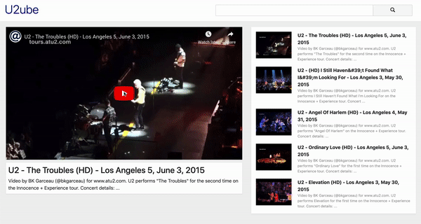

# U2ube
The U2ube project is part of the recast.ly project I completed as a student at [hackreactor](http://hackreactor.com). The project is a frontend YouTube replication application that uses the React Library as well as the JQuery AJAX functionality to send API requests to YouTube. The project utilized pair programming. 

## Demo

